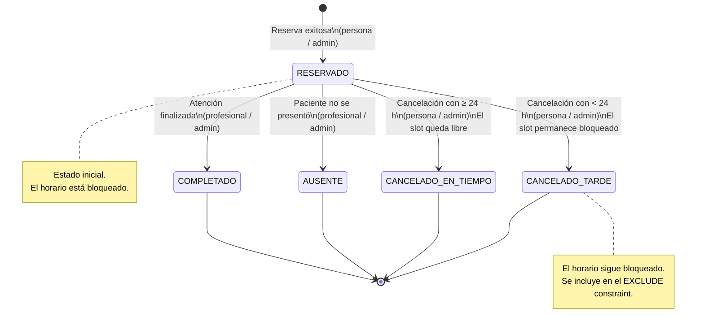
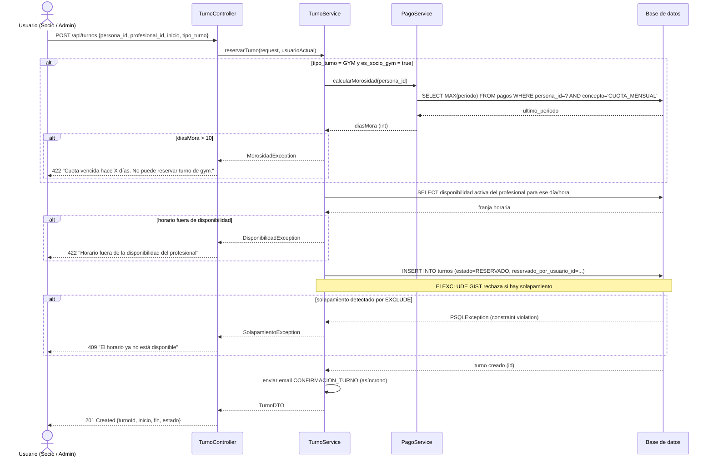
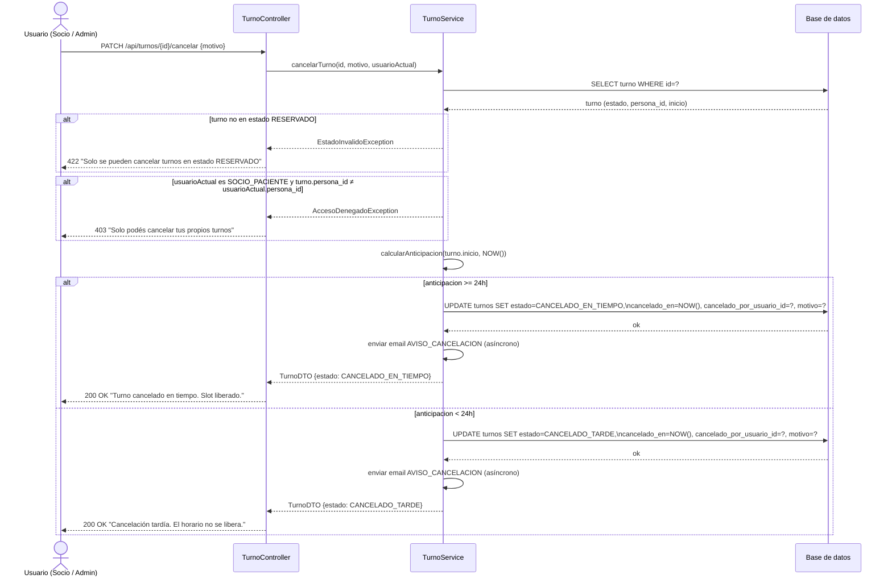
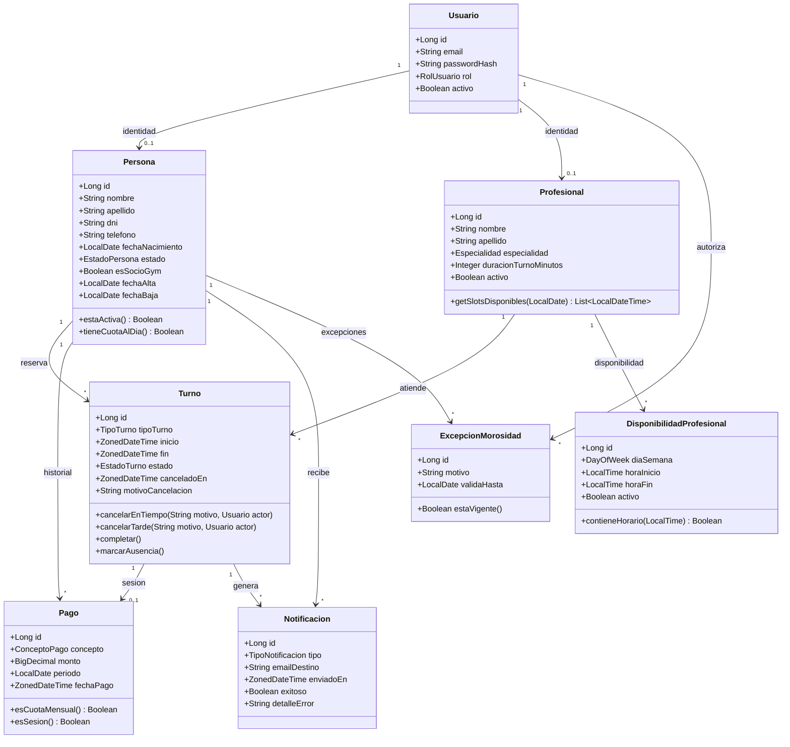
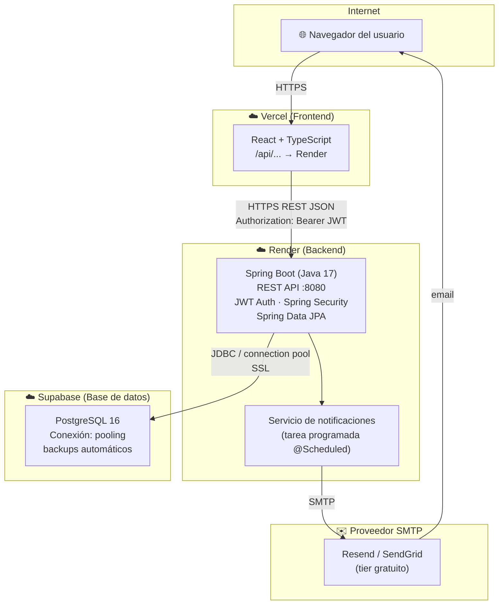

# Diagramas del Sistema — Vitalys App

> **2.ª Entrega — Trabajo Final Integrador**  
> Tecnicatura Universitaria en Programación · UTN · 2026  
> Integrantes: Renzo Calcatelli · Pablo Basualdo Arcati · Tutora: Sofía Raia

---

## 1. Diagrama de Casos de Uso

```mermaid
graph TD
    subgraph Actores
        SP([SOCIO_PACIENTE])
        PR([PROFESIONAL])
        AD([ADMIN])
    end

    subgraph Auth
        UC01[Registrarse]
        UC02[Iniciar sesión]
        UC03[Cerrar sesión]
    end

    subgraph Personas
        UC04[Gestionar perfil propio]
        UC05[ABM de personas]
    end

    subgraph Profesionales
        UC06[Listar profesionales]
        UC07[ABM de profesionales]
        UC08[Gestionar disponibilidad propia]
        UC09[Gestionar disponibilidad de cualquier profesional]
    end

    subgraph Turnos
        UC10[Consultar slots disponibles]
        UC11[Reservar turno de consultorio]
        UC12[Reservar turno de gym]
        UC13[Cancelar turno propio]
        UC14[Cancelar cualquier turno]
        UC15[Ver agenda propia]
        UC16[Ver mis turnos]
        UC17[Marcar completado / ausencia]
    end

    subgraph Pagos
        UC18[Ver estado de cuenta propio]
        UC19[Ver estado de cuenta de cualquier persona]
        UC20[Registrar pago]
    end

    subgraph Morosidad
        UC21[Registrar excepción de morosidad]
    end

    subgraph Notificaciones
        UC22[Ver historial de notificaciones]
    end

    SP --> UC01
    SP --> UC02
    SP --> UC03
    SP --> UC04
    SP --> UC10
    SP --> UC11
    SP --> UC12
    SP --> UC13
    SP --> UC16
    SP --> UC18

    PR --> UC02
    PR --> UC03
    PR --> UC06
    PR --> UC08
    PR --> UC10
    PR --> UC15
    PR --> UC17

    AD --> UC02
    AD --> UC03
    AD --> UC05
    AD --> UC07
    AD --> UC09
    AD --> UC10
    AD --> UC11
    AD --> UC12
    AD --> UC14
    AD --> UC19
    AD --> UC20
    AD --> UC21
    AD --> UC22
```

---

## 2. Diagrama de Estados del Turno

---

## 3. Diagrama de Secuencia — Reservar un turno

---

## 4. Diagrama de Secuencia — Cancelar un turno

---

## 5. Diagrama de Clases del Dominio

---

## 6. Diagrama de Arquitectura y Despliegue

