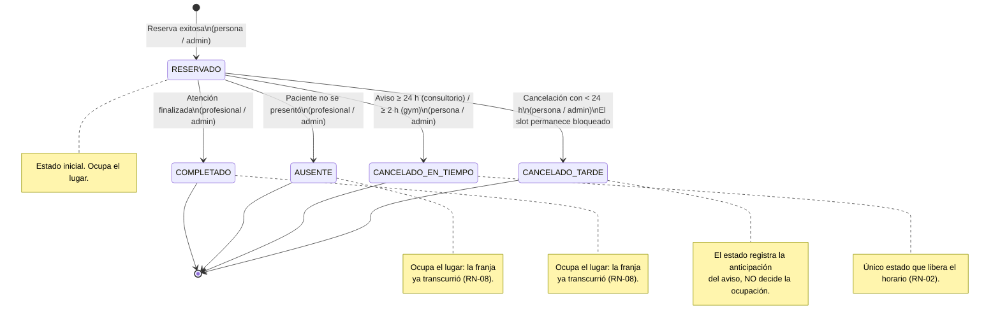
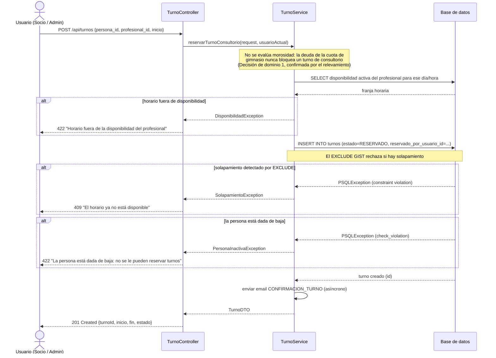
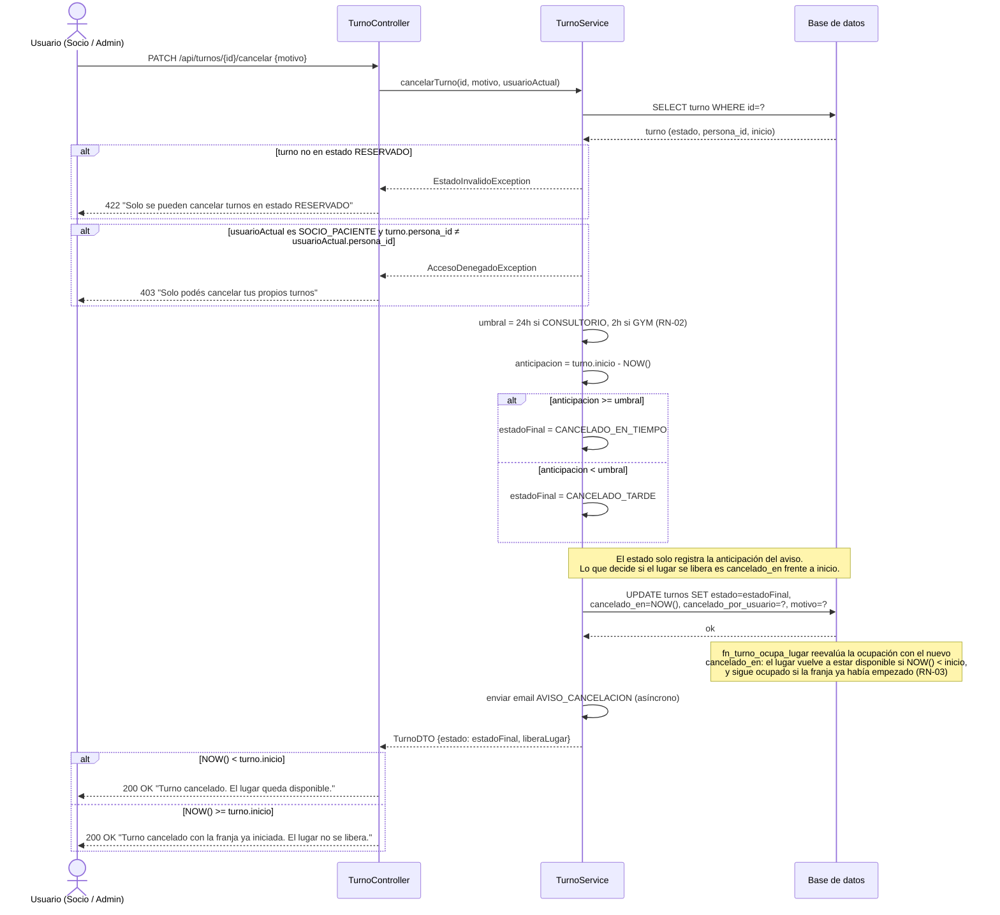
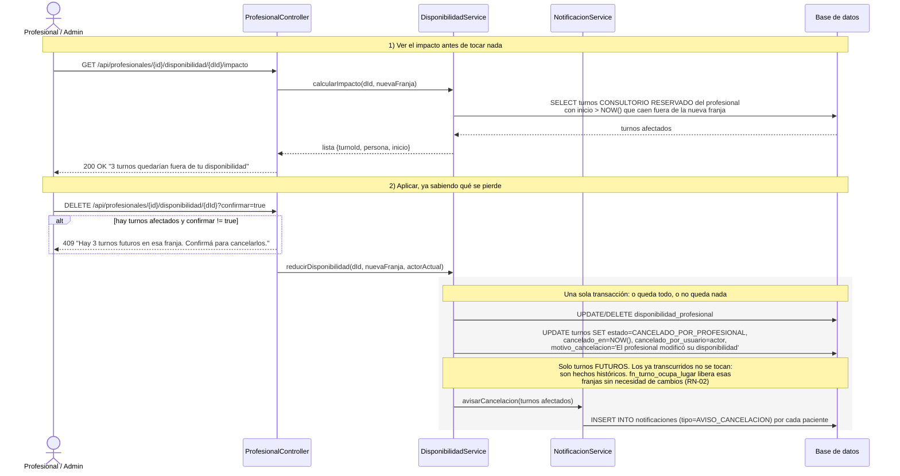
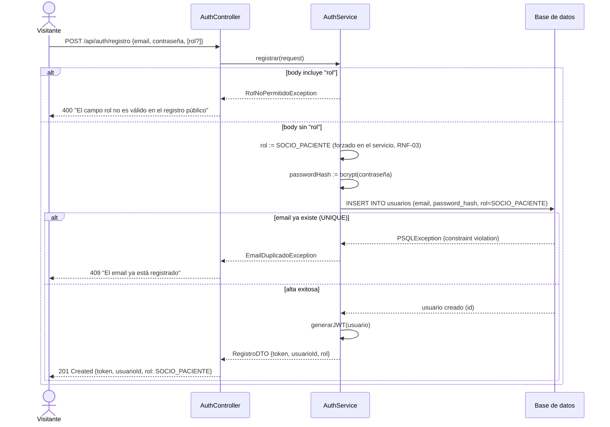
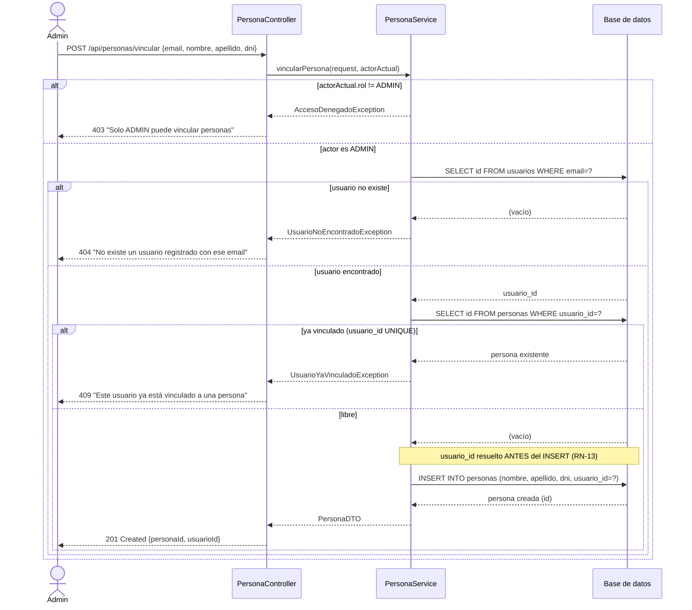
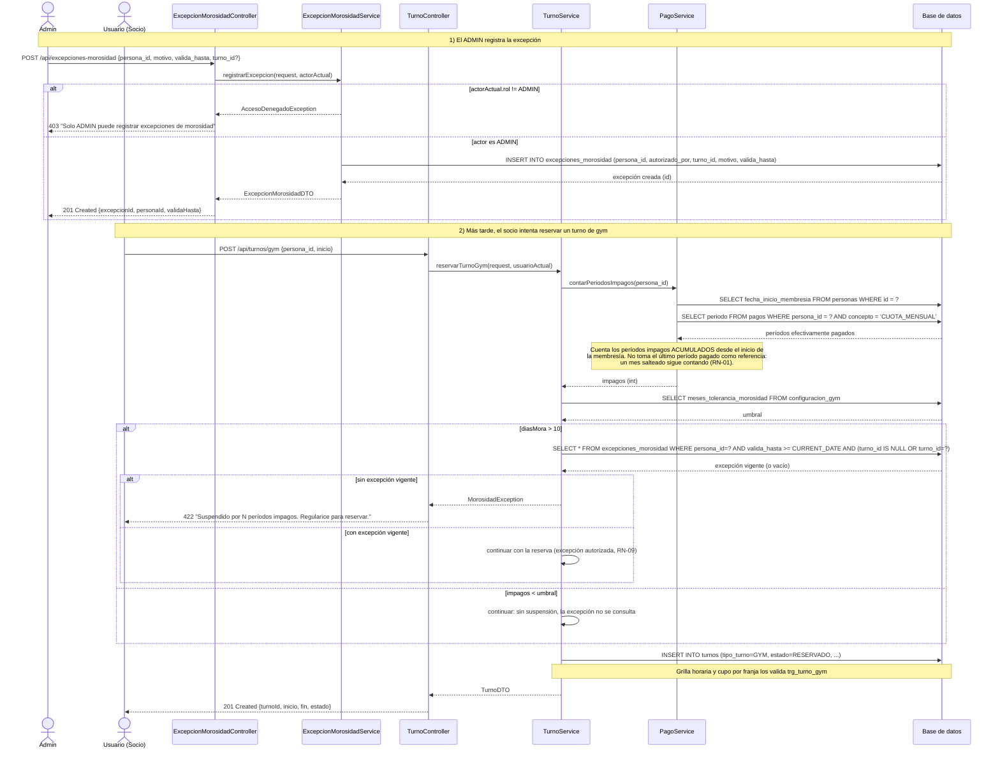
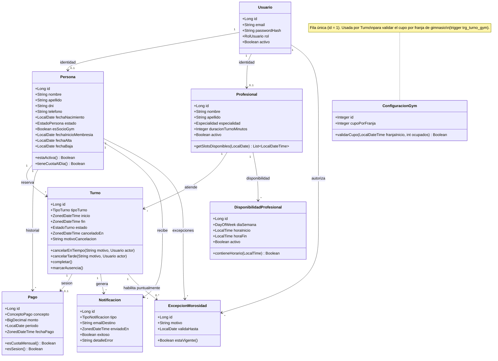
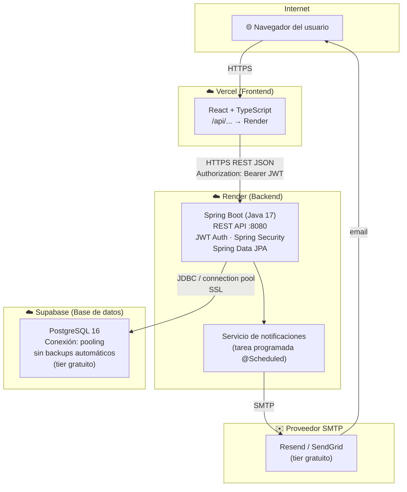

# Diagramas del Sistema — Vitalys App

> **2.ª Entrega — Trabajo Final Integrador**  
> Tecnicatura Universitaria en Programación · UTN · 2026  
> Integrantes: Renzo Calcatelli · Pablo Basualdo Arcati · Tutora: Sofía Raia

---

## 1. Diagrama de Casos de Uso

```mermaid
graph TD
    subgraph Actores
        SP([SOCIO_PACIENTE])
        PR([PROFESIONAL])
        AD([ADMIN])
    end

    subgraph Auth
        UC01[Registrarse]
        UC02[Iniciar sesión]
        UC03[Cerrar sesión]
    end

    subgraph Personas
        UC04[Gestionar perfil propio]
        UC05[ABM de personas]
    end

    subgraph Profesionales
        UC06[Listar profesionales]
        UC07[ABM de profesionales]
        UC08[Gestionar disponibilidad propia]
        UC09[Gestionar disponibilidad de cualquier profesional]
    end

    subgraph Turnos
        UC10[Consultar slots disponibles]
        UC11[Reservar turno de consultorio]
        UC12[Reservar turno de gym]
        UC13[Cancelar turno propio]
        UC14[Cancelar cualquier turno]
        UC15[Ver agenda propia]
        UC16[Ver mis turnos]
        UC17[Marcar completado / ausencia]
    end

    subgraph Pagos
        UC18[Ver estado de cuenta propio]
        UC19[Ver estado de cuenta de cualquier persona]
        UC20[Registrar pago]
    end

    subgraph Morosidad
        UC21[Registrar excepción de morosidad]
    end

    subgraph Notificaciones
        UC22[Ver historial de notificaciones]
    end

    SP --> UC01
    SP --> UC02
    SP --> UC03
    SP --> UC04
    SP --> UC10
    SP --> UC11
    SP --> UC12
    SP --> UC13
    SP --> UC16
    SP --> UC18

    PR --> UC02
    PR --> UC03
    PR --> UC06
    PR --> UC08
    PR --> UC10
    PR --> UC15
    PR --> UC17

    AD --> UC02
    AD --> UC03
    AD --> UC05
    AD --> UC07
    AD --> UC09
    AD --> UC10
    AD --> UC11
    AD --> UC12
    AD --> UC14
    AD --> UC17
    AD --> UC19
    AD --> UC20
    AD --> UC21
    AD --> UC22
```

---

## 2. Diagrama de Estados del Turno

```mermaid
stateDiagram-v2
    [*] --> RESERVADO : Reserva exitosa\n(persona / admin)

    RESERVADO --> COMPLETADO : Atención finalizada\n(profesional / admin)

    RESERVADO --> AUSENTE : Paciente no se presentó\n(profesional / admin)

    RESERVADO --> CANCELADO_EN_TIEMPO : Aviso ≥ 24 h (consultorio) / ≥ 2 h (gym)\n(persona / admin)

    RESERVADO --> CANCELADO_TARDE : Cancelación con < 24 h\n(persona / admin)\nEl slot permanece bloqueado

    COMPLETADO --> [*]
    AUSENTE --> [*]
    CANCELADO_EN_TIEMPO --> [*]
    CANCELADO_TARDE --> [*]

    note right of RESERVADO
        Estado inicial. Ocupa el lugar.
    end note

    note right of AUSENTE
        Ocupa el lugar: la franja
        ya transcurrió (RN-08).
    end note

    note right of COMPLETADO
        Ocupa el lugar: la franja
        ya transcurrió (RN-08).
    end note

    note right of CANCELADO_TARDE
        El estado registra la anticipación
        del aviso, NO decide la ocupación.
    end note

    note right of CANCELADO_EN_TIEMPO
        Único estado que libera el horario (RN-02).
    end note
```

**Lo que ocupa el lugar no es el estado, sino el momento de la cancelación.** Los estados `RESERVADO`, `COMPLETADO` y `AUSENTE` siempre ocupan. Los tres estados de cancelación ocupan **solo si `cancelado_en >= inicio`**: una cancelación registrada antes de que empiece la franja libera el lugar, sea en tiempo o tarde, y otra persona puede tomarlo. La distinción en tiempo/tarde se conserva como registro de la anticipación del aviso. Los tres controles del motor comparten esta definición en `fn_turno_ocupa_lugar` (RN-02, RN-03).

---

## 3. Diagramas de Secuencia — Reservar un turno

Reservar consultorio y reservar gimnasio son **dos circuitos distintos**, con rutas propias (`POST /api/turnos` y `POST /api/turnos/gym`, ver Módulo 3), validaciones que no se comparten y capas de aplicación diferentes. Por eso se documentan por separado en lugar de como ramas de un mismo flujo: unificarlos sugiere que el turno de gimnasio pasa por la disponibilidad de un profesional que no tiene.

### 3.1. Reservar un turno de CONSULTORIO

```mermaid
sequenceDiagram
    actor U as Usuario (Socio / Admin)
    participant API as TurnoController
    participant TS as TurnoService
    participant DB as Base de datos

    U->>API: POST /api/turnos {persona_id, profesional_id, inicio}
    API->>TS: reservarTurnoConsultorio(request, usuarioActual)

    Note over TS: No se evalúa morosidad: la deuda de la cuota de<br/>gimnasio nunca bloquea un turno de consultorio<br/>(Decisión de dominio 1, confirmada por el relevamiento)

    TS->>DB: SELECT disponibilidad activa del profesional para ese día/hora
    DB-->>TS: franja horaria

    alt horario fuera de disponibilidad
        TS-->>API: DisponibilidadException
        API-->>U: 422 "Horario fuera de la disponibilidad del profesional"
    end

    TS->>DB: INSERT INTO turnos (estado=RESERVADO, reservado_por_usuario_id=...)
    Note over TS,DB: El EXCLUDE GIST rechaza si hay solapamiento
    alt solapamiento detectado por EXCLUDE
        DB-->>TS: PSQLException (constraint violation)
        TS-->>API: SolapamientoException
        API-->>U: 409 "El horario ya no está disponible"
    end
    alt la persona está dada de baja
        DB-->>TS: PSQLException (check_violation)
        TS-->>API: PersonaInactivaException
        API-->>U: 422 "La persona está dada de baja: no se le pueden reservar turnos"
    end

    DB-->>TS: turno creado (id)
    TS->>TS: enviar email CONFIRMACION_TURNO (asíncrono)
    TS-->>API: TurnoDTO
    API-->>U: 201 Created {turnoId, inicio, fin, estado}
```

### 3.2. Reservar un turno de GIMNASIO

```mermaid
sequenceDiagram
    actor U as Usuario (Socio / Admin)
    participant API as TurnoController
    participant TS as TurnoService
    participant PS as PagoService
    participant DB as Base de datos

    U->>API: POST /api/turnos/gym {persona_id, inicio}
    API->>TS: reservarTurnoGym(request, usuarioActual)

    Note over TS: No se consulta disponibilidad de profesional:<br/>el turno de gimnasio no tiene profesional asignado<br/>(profesional_id = NULL)

    TS->>PS: contarPeriodosImpagos(persona_id)
    PS->>DB: SELECT fecha_inicio_membresia FROM personas WHERE id = ?
    PS->>DB: SELECT periodo FROM pagos WHERE persona_id = ? AND concepto = 'CUOTA_MENSUAL'
    DB-->>PS: períodos efectivamente pagados
    Note over PS: Recorre mes a mes DESDE fecha_inicio_membresia.<br/>Cuenta impago todo período P con NOW() > P + 1 mes + 10 días<br/>sin cuota registrada. Un mes salteado sigue contando aunque<br/>se hayan pagado los posteriores: NO se usa el último período<br/>pagado como referencia (RN-01).
    PS-->>TS: impagos (int)

    TS->>DB: SELECT meses_tolerancia_morosidad FROM configuracion_gym
    DB-->>TS: umbral

    alt impagos >= umbral — socio SUSPENDIDO
        TS->>DB: SELECT * FROM excepciones_morosidad WHERE persona_id = ?<br/>AND valida_hasta >= CURRENT_DATE AND (NOT un_solo_uso OR turno_id IS NULL)
        DB-->>TS: excepción vigente (o vacío)
        alt sin excepción vigente
            TS-->>API: MorosidadException
            API-->>U: 422 "Suspendido por N períodos impagos. Regularice para reservar."
        else con excepción vigente
            TS->>TS: continuar con la reserva (RN-09)
        end
    else 0 < impagos < umbral — CON DEUDA
        TS->>TS: continuar: la deuda por debajo del umbral NO bloquea (RN-01)
    end

    TS->>DB: INSERT INTO turnos (tipo_turno=GYM, profesional_id=NULL, estado=RESERVADO)
    Note over TS,DB: El motor valida: grilla horaria y feriados, membresía de gimnasio,<br/>un turno por persona y día y cupo por franja (trg_turno_gym, con<br/>pg_advisory_xact_lock contra la condición de carrera); que la persona<br/>no esté de baja (trg_turno_persona_activa, RN-21); y que no tenga otro<br/>turno superpuesto (excl_turnos_persona_overlap, RN-22)
    alt regla de gimnasio rechazada por el motor
        DB-->>TS: PSQLException (raise exception)
        TS-->>API: ReglaGymException
        API-->>U: 409 "Cupo completo" · 422 según la regla violada
    end

    opt la reserva usó una excepción de un solo uso
        TS->>DB: UPDATE excepciones_morosidad SET turno_id = ? — se consume
        Note over TS,DB: turno_id se completa DESPUÉS de crear el turno:<br/>al pedir la excepción, el turno todavía no existía (RN-23)
    end

    DB-->>TS: turno creado (id)
    TS->>TS: enviar email CONFIRMACION_TURNO (asíncrono)
    TS-->>API: TurnoDTO
    API-->>U: 201 Created {turnoId, inicio, fin, estado}
```

---

## 4. Diagrama de Secuencia — Cancelar un turno

```mermaid
sequenceDiagram
    actor U as Usuario (Socio / Admin)
    participant API as TurnoController
    participant TS as TurnoService
    participant DB as Base de datos

    U->>API: PATCH /api/turnos/{id}/cancelar {motivo}

    API->>TS: cancelarTurno(id, motivo, usuarioActual)

    TS->>DB: SELECT turno WHERE id=?
    DB-->>TS: turno (estado, persona_id, inicio)

    alt turno no en estado RESERVADO
        TS-->>API: EstadoInvalidoException
        API-->>U: 422 "Solo se pueden cancelar turnos en estado RESERVADO"
    end

    alt usuarioActual es SOCIO_PACIENTE y turno.persona_id ≠ usuarioActual.persona_id
        TS-->>API: AccesoDenegadoException
        API-->>U: 403 "Solo podés cancelar tus propios turnos"
    end

    TS->>TS: umbral = 24h si CONSULTORIO, 2h si GYM (RN-02)
    TS->>TS: anticipacion = turno.inicio - NOW()

    alt anticipacion >= umbral
        TS->>TS: estadoFinal = CANCELADO_EN_TIEMPO
    else anticipacion < umbral
        TS->>TS: estadoFinal = CANCELADO_TARDE
    end

    Note over TS,DB: El estado solo registra la anticipación del aviso.<br/>Lo que decide si el lugar se libera es cancelado_en frente a inicio.

    TS->>DB: UPDATE turnos SET estado=estadoFinal,<br/>cancelado_en=NOW(), cancelado_por_usuario=?, motivo=?
    DB-->>TS: ok
    Note over DB: fn_turno_ocupa_lugar reevalúa la ocupación con el nuevo<br/>cancelado_en: el lugar vuelve a estar disponible si NOW() < inicio,<br/>y sigue ocupado si la franja ya había empezado (RN-03)

    TS->>TS: enviar email AVISO_CANCELACION (asíncrono)
    TS-->>API: TurnoDTO {estado: estadoFinal, liberaLugar}

    alt NOW() < turno.inicio
        API-->>U: 200 OK "Turno cancelado. El lugar queda disponible."
    else NOW() >= turno.inicio
        API-->>U: 200 OK "Turno cancelado con la franja ya iniciada. El lugar no se libera."
    end
```

---

## 4b. Diagrama de Secuencia — Reducir la disponibilidad de un profesional

Cancelar turnos de terceros es una acción destructiva, así que la operación va en **dos
pasos**: primero se consulta el impacto, y recién con confirmación explícita se aplica
(RN-24, cierra el hallazgo 5 del RFC-001).

```mermaid
sequenceDiagram
    actor P as Profesional / Admin
    participant API as ProfesionalController
    participant DS as DisponibilidadService
    participant NS as NotificacionService
    participant DB as Base de datos

    Note over P,DB: 1) Ver el impacto antes de tocar nada
    P->>API: GET /api/profesionales/{id}/disponibilidad/{dId}/impacto
    API->>DS: calcularImpacto(dId, nuevaFranja)
    DS->>DB: SELECT turnos CONSULTORIO RESERVADO del profesional<br/>con inicio > NOW() que caen fuera de la nueva franja
    DB-->>DS: turnos afectados
    DS-->>API: lista {turnoId, persona, inicio}
    API-->>P: 200 OK "3 turnos quedarían fuera de tu disponibilidad"

    Note over P,DB: 2) Aplicar, ya sabiendo qué se pierde
    P->>API: DELETE /api/profesionales/{id}/disponibilidad/{dId}?confirmar=true

    alt hay turnos afectados y confirmar != true
        API-->>P: 409 "Hay 3 turnos futuros en esa franja. Confirmá para cancelarlos."
    end

    API->>DS: reducirDisponibilidad(dId, nuevaFranja, actorActual)

    rect rgb(245, 245, 245)
        Note over DS,DB: Una sola transacción: o queda todo, o no queda nada
        DS->>DB: UPDATE/DELETE disponibilidad_profesional
        DS->>DB: UPDATE turnos SET estado=CANCELADO_POR_PROFESIONAL,<br/>cancelado_en=NOW(), cancelado_por_usuario=actor,<br/>motivo_cancelacion='El profesional modificó su disponibilidad'
        Note over DS,DB: Solo turnos FUTUROS. Los ya transcurridos no se tocan:<br/>son hechos históricos. fn_turno_ocupa_lugar libera esas<br/>franjas sin necesidad de cambios (RN-02)
        DS->>NS: avisarCancelacion(turnos afectados)
        NS->>DB: INSERT INTO notificaciones (tipo=AVISO_CANCELACION) por cada paciente
    end
```

---

## 5. Diagrama de Secuencia — Registro público (rol forzado)

```mermaid
sequenceDiagram
    actor V as Visitante
    participant API as AuthController
    participant AS as AuthService
    participant DB as Base de datos

    V->>API: POST /api/auth/registro {email, contraseña, [rol?]}
    API->>AS: registrar(request)

    alt body incluye "rol"
        AS-->>API: RolNoPermitidoException
        API-->>V: 400 "El campo rol no es válido en el registro público"
    else body sin "rol"
        AS->>AS: rol := SOCIO_PACIENTE (forzado en el servicio, RNF-03)
        AS->>AS: passwordHash := bcrypt(contraseña)
        AS->>DB: INSERT INTO usuarios (email, password_hash, rol=SOCIO_PACIENTE)
        alt email ya existe (UNIQUE)
            DB-->>AS: PSQLException (constraint violation)
            AS-->>API: EmailDuplicadoException
            API-->>V: 409 "El email ya está registrado"
        else alta exitosa
            DB-->>AS: usuario creado (id)
            AS->>AS: generarJWT(usuario)
            AS-->>API: RegistroDTO {token, usuarioId, rol}
            API-->>V: 201 Created {token, usuarioId, rol: SOCIO_PACIENTE}
        end
    end
```

---

## 6. Diagrama de Secuencia — ADMIN vincula ficha a usuario existente

```mermaid
sequenceDiagram
    actor A as Admin
    participant API as PersonaController
    participant PS as PersonaService
    participant DB as Base de datos

    A->>API: POST /api/personas/vincular {email, nombre, apellido, dni}
    API->>PS: vincularPersona(request, actorActual)

    alt actorActual.rol != ADMIN
        PS-->>API: AccesoDenegadoException
        API-->>A: 403 "Solo ADMIN puede vincular personas"
    else actor es ADMIN
        PS->>DB: SELECT id FROM usuarios WHERE email=?
        alt usuario no existe
            DB-->>PS: (vacío)
            PS-->>API: UsuarioNoEncontradoException
            API-->>A: 404 "No existe un usuario registrado con ese email"
        else usuario encontrado
            DB-->>PS: usuario_id
            PS->>DB: SELECT id FROM personas WHERE usuario_id=?
            alt ya vinculado (usuario_id UNIQUE)
                DB-->>PS: persona existente
                PS-->>API: UsuarioYaVinculadoException
                API-->>A: 409 "Este usuario ya está vinculado a una persona"
            else libre
                DB-->>PS: (vacío)
                Note over PS,DB: usuario_id resuelto ANTES del INSERT (RN-13)
                PS->>DB: INSERT INTO personas (nombre, apellido, dni, usuario_id=?)
                DB-->>PS: persona creada (id)
                PS-->>API: PersonaDTO
                API-->>A: 201 Created {personaId, usuarioId}
            end
        end
    end
```

---

## 7. Diagrama de Secuencia — Registrar y consultar una excepción de morosidad

```mermaid
sequenceDiagram
    actor A as Admin
    actor U as Usuario (Socio)
    participant API as ExcepcionMorosidadController
    participant ES as ExcepcionMorosidadService
    participant TC as TurnoController
    participant TS as TurnoService
    participant PS as PagoService
    participant DB as Base de datos

    Note over A,DB: 1) El ADMIN registra la excepción
    A->>API: POST /api/excepciones-morosidad {persona_id, motivo, valida_hasta, turno_id?}
    API->>ES: registrarExcepcion(request, actorActual)

    alt actorActual.rol != ADMIN
        ES-->>API: AccesoDenegadoException
        API-->>A: 403 "Solo ADMIN puede registrar excepciones de morosidad"
    else actor es ADMIN
        ES->>DB: INSERT INTO excepciones_morosidad (persona_id, autorizado_por, turno_id, motivo, valida_hasta)
        DB-->>ES: excepción creada (id)
        ES-->>API: ExcepcionMorosidadDTO
        API-->>A: 201 Created {excepcionId, personaId, validaHasta}
    end

    Note over U,DB: 2) Más tarde, el socio intenta reservar un turno de gym
    U->>TC: POST /api/turnos/gym {persona_id, inicio}
    TC->>TS: reservarTurnoGym(request, usuarioActual)

    TS->>PS: contarPeriodosImpagos(persona_id)
    PS->>DB: SELECT fecha_inicio_membresia FROM personas WHERE id = ?
    PS->>DB: SELECT periodo FROM pagos WHERE persona_id = ? AND concepto = 'CUOTA_MENSUAL'
    DB-->>PS: períodos efectivamente pagados
    Note over PS: Cuenta los períodos impagos ACUMULADOS desde el inicio de<br/>la membresía. No toma el último período pagado como referencia:<br/>un mes salteado sigue contando (RN-01).
    PS-->>TS: impagos (int)

    TS->>DB: SELECT meses_tolerancia_morosidad FROM configuracion_gym
    DB-->>TS: umbral

    alt diasMora > 10
        TS->>DB: SELECT * FROM excepciones_morosidad WHERE persona_id=? AND valida_hasta >= CURRENT_DATE AND (turno_id IS NULL OR turno_id=?)
        DB-->>TS: excepción vigente (o vacío)
        alt sin excepción vigente
            TS-->>TC: MorosidadException
            TC-->>U: 422 "Suspendido por N períodos impagos. Regularice para reservar."
        else con excepción vigente
            TS->>TS: continuar con la reserva (excepción autorizada, RN-09)
        end
    else impagos < umbral
        TS->>TS: continuar: sin suspensión, la excepción no se consulta
    end

    TS->>DB: INSERT INTO turnos (tipo_turno=GYM, estado=RESERVADO, ...)
    Note over TS,DB: Grilla horaria y cupo por franja los valida trg_turno_gym
    TS-->>TC: TurnoDTO
    TC-->>U: 201 Created {turnoId, inicio, fin, estado}
```

---

## 8. Diagrama de Clases del Dominio

```mermaid
classDiagram
    class Usuario {
        +Long id
        +String email
        +String passwordHash
        +RolUsuario rol
        +Boolean activo
    }

    class Persona {
        +Long id
        +String nombre
        +String apellido
        +String dni
        +String telefono
        +LocalDate fechaNacimiento
        +EstadoPersona estado
        +Boolean esSocioGym
        +LocalDate fechaInicioMembresia
        +LocalDate fechaAlta
        +LocalDate fechaBaja
        +estaActiva() Boolean
        +tieneCuotaAlDia() Boolean
    }

    class Profesional {
        +Long id
        +String nombre
        +String apellido
        +Especialidad especialidad
        +Integer duracionTurnoMinutos
        +Boolean activo
        +getSlotsDisponibles(LocalDate) List~LocalDateTime~
    }

    class DisponibilidadProfesional {
        +Long id
        +DayOfWeek diaSemana
        +LocalTime horaInicio
        +LocalTime horaFin
        +Boolean activo
        +contieneHorario(LocalTime) Boolean
    }

    class Turno {
        +Long id
        +TipoTurno tipoTurno
        +ZonedDateTime inicio
        +ZonedDateTime fin
        +EstadoTurno estado
        +ZonedDateTime canceladoEn
        +String motivoCancelacion
        +cancelarEnTiempo(String motivo, Usuario actor)
        +cancelarTarde(String motivo, Usuario actor)
        +completar()
        +marcarAusencia()
    }

    class ExcepcionMorosidad {
        +Long id
        +String motivo
        +LocalDate validaHasta
        +Boolean estaVigente() 
    }

    class ConfiguracionGym {
        +Integer id
        +Integer cupoPorFranja
        +validarCupo(LocalDateTime franjaInicio, int ocupados) Boolean
    }

    class Pago {
        +Long id
        +ConceptoPago concepto
        +BigDecimal monto
        +LocalDate periodo
        +ZonedDateTime fechaPago
        +esCuotaMensual() Boolean
        +esSesion() Boolean
    }

    class Notificacion {
        +Long id
        +TipoNotificacion tipo
        +String emailDestino
        +ZonedDateTime enviadoEn
        +Boolean exitoso
        +String detalleError
    }

    Usuario "1" --> "0..1" Persona : identidad
    Usuario "1" --> "0..1" Profesional : identidad
    Persona "1" --> "*" Turno : reserva
    Profesional "1" --> "*" Turno : atiende
    Profesional "1" --> "*" DisponibilidadProfesional : disponibilidad
    Turno "1" --> "0..1" Pago : sesion
    Persona "1" --> "*" Pago : historial
    Persona "1" --> "*" Notificacion : recibe
    Turno "1" --> "*" Notificacion : genera
    Persona "1" --> "*" ExcepcionMorosidad : excepciones
    Usuario "1" --> "*" ExcepcionMorosidad : autoriza
    Turno "1" --> "0..*" ExcepcionMorosidad : habilita puntualmente

    note for ConfiguracionGym "Fila única (id = 1). Usada por Turno\npara validar el cupo por franja de gimnasio\n(trigger trg_turno_gym)."
```

---

## 9. Diagrama de Arquitectura y Despliegue

```mermaid
graph TB
    subgraph Internet
        NAV[🌐 Navegador del usuario]
    end

    subgraph Vercel["☁️ Vercel (Frontend)"]
        REACT["React + TypeScript\n/api/... → Render"]
    end

    subgraph Render["☁️ Render (Backend)"]
        SB["Spring Boot (Java 17)\nREST API :8080\nJWT Auth · Spring Security\nSpring Data JPA"]
        NOTIF["Servicio de notificaciones\n(tarea programada @Scheduled)"]
    end

    subgraph Supabase["☁️ Supabase (Base de datos)"]
        PG["PostgreSQL 16\nConexión: pooling\nsin backups automáticos\n(tier gratuito)"]
    end

    subgraph Email["✉️ Proveedor SMTP"]
        SMTP["Resend / SendGrid\n(tier gratuito)"]
    end

    NAV -->|HTTPS| REACT
    REACT -->|HTTPS REST JSON\nAuthorization: Bearer JWT| SB
    SB -->|JDBC / connection pool\nSSL| PG
    NOTIF -->|SMTP| SMTP
    SMTP -->|email| NAV
    SB --> NOTIF
```
